# oracle-java-spring-dss

[Abishek Arumugam Thiruselvi](https://www.abishekarumugam.com)

# Running the Application in Eclipse
#### Prerequisites: Eclipse IDE plugins Buildship Gradle Integration 3.0, Spring Tools 3, Git, Java 17 or greater, Maven 3.9 or higher and Gradle 7.6 or higher.

1. Open Git Perspective in Eclipse and clone this [repository]([https://github.com/abishekat/oracle-spring-dss-assignment-1](https://github.com/abishekat/dss-assignment-1))

2. Import the project into project explorer.

3. Right-click on the project in the project explorer 

   ```shell
   run -> clean install
   ```
4. To run the application right-click on the project in the project explorer 

   ```shell
   run > java application / junit
   ```
5. To run the application on terminal 

   ```shell
   mvn spring-boot:run
   ```

# Running the Application in Oracle Cloud VM

####  Follow the steps from this [URL](https://github.com/youyinnn/distributed_system_jetty_helloworld/blob/main/Oracle%20Cloud%20VM%20Setup.md) and clone this project

To run the application on Cloud VM 

   ```shell
    mvn spring-boot:run
   ```
To test the application on Postman or in OpenAPI

   ```shell
   http://<public-ip>:8080/audio/api/
   ```
   
# OpenAPI
#### OpenAPI test works only for cloud deployment. Does not work for localhost. Because of firewall conflict on port 22.
#### For localhost openapi test to work run the spring application and got to [http://localhost:8080/swagger-ui/index.html](http://localhost:8080/swagger-ui/index.html)


## RESULTS

#### Client Vs. Oracle VM Time to complete request
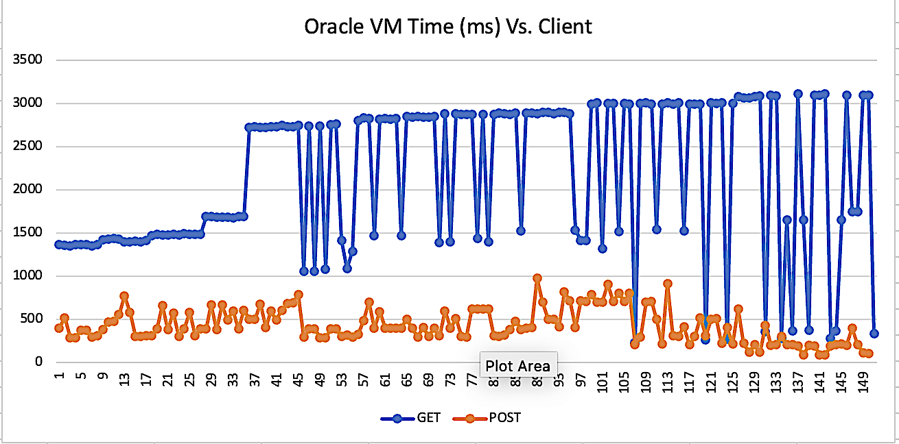

#### Client Vs. Localhost Time to complete request
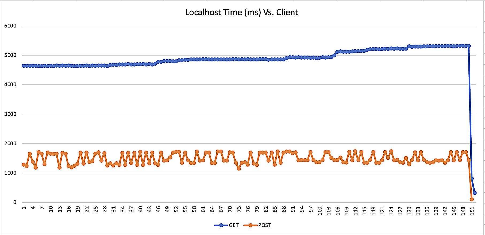

#### Create Audio Item - OpenAPI
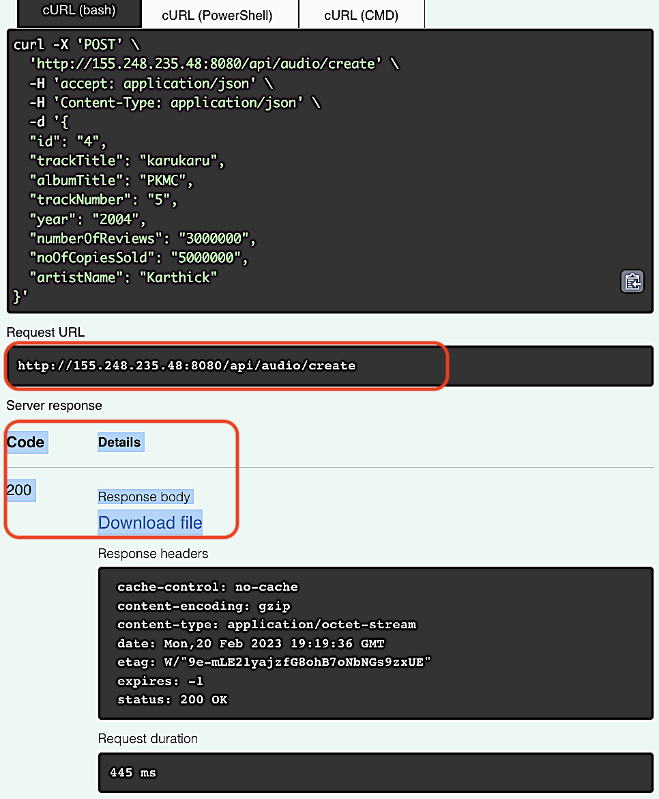

####  Get: Copies Sold – OpenAPI
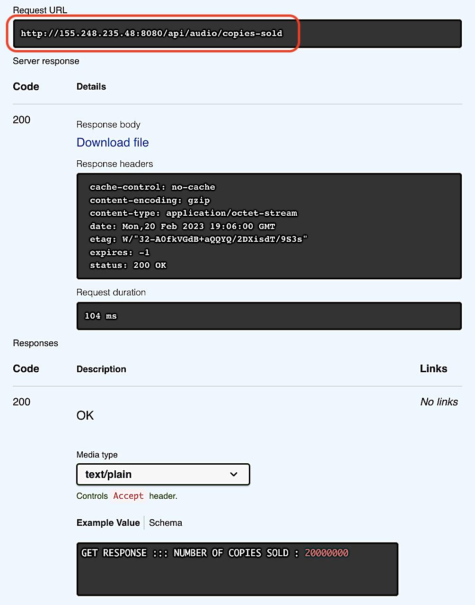

####  Get: Artist by ID – OpenAPI
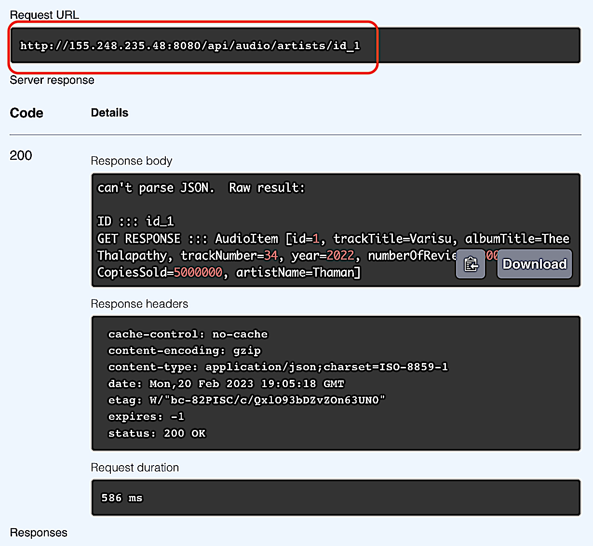

####  Get: Artist by name and Property – OpenAPI
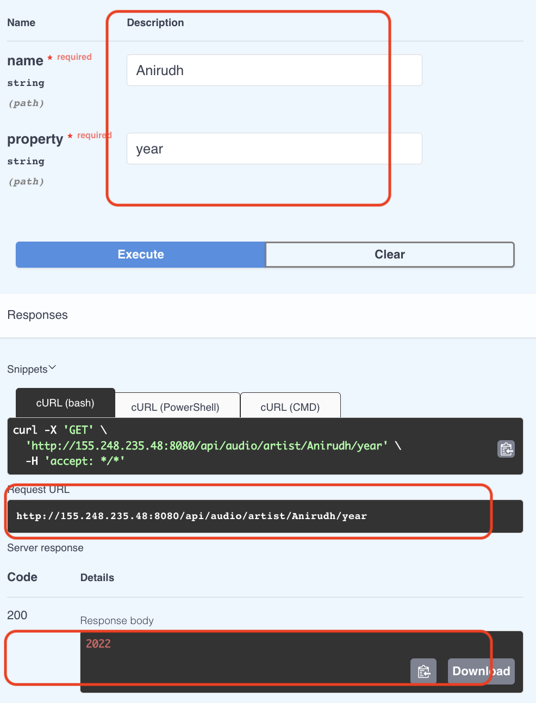

####  Get: Artist by Name – OpenAPI
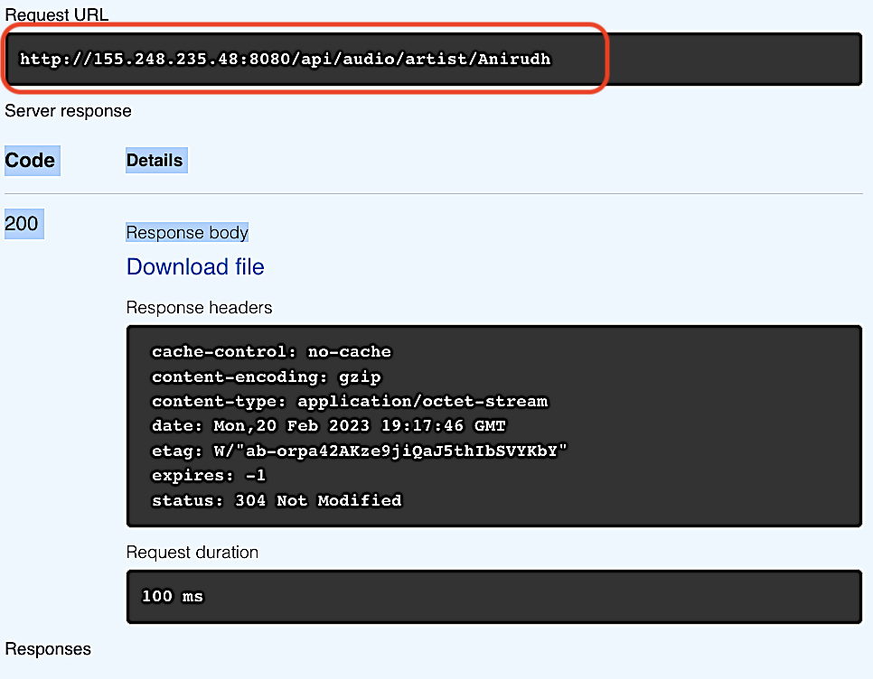

####  Get: All Artist in JSON– OpenAPI
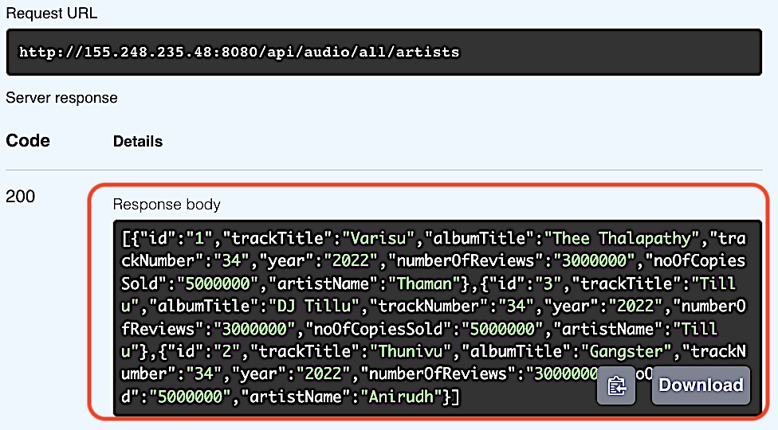

####  Get: Copies sold before creating and audio item.
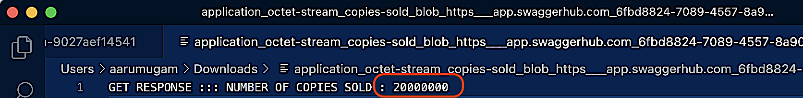

####  Get: Copies sold after creating and audio item.
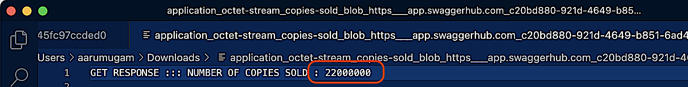

#### Project Structure
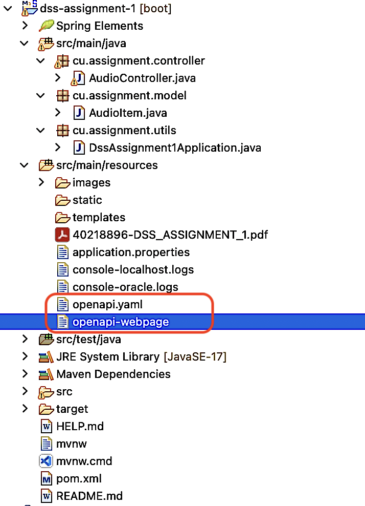

## Concurrent Clients Test logs file

```shell
   PATH : src/main/resources/console-oracle.logs
   PATH : src/main/resources/console-localhost.logs
   ```

### UNIVERSITY

 [CONCORDIA UNIVERSITY](https://www.concordia.ca/).
  
